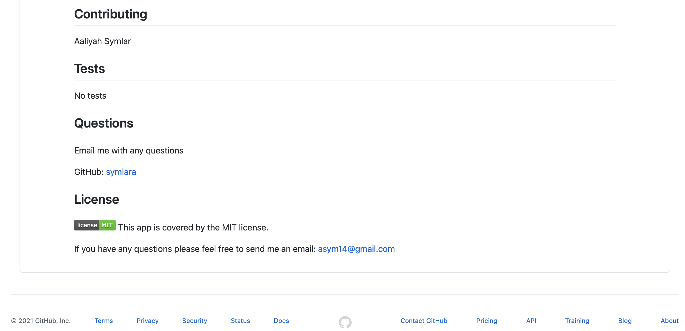

 # README-Generator

  This video clip shows the functionality of this application: 

<a href="https://drive.google.com/file/d/16_1hdrkF7zrdFKlPjO8QfvxQWs7NoF6K/view">READMEGenerator</a>

 
  
  ## Table of Contents
  - [Description](#description)
  - [Installation Instructions](#installation-instructions)
  - [Usage](#usage)
  - [Contributing](#contributing)
  - [Tests](#tests)
  - [Questions](#questions)
  - [License](#license)

  ## Description
  This app is used to generate a README file that will help developers display an informative README in their repos. This project was created using Node.js through the Terminal as well as the npm inquirer package. When a user answers each question in the terminal their inputs generate a README File in the dist folder of the repo.

  

 ## Installation Instructions
 * https://nodejs.org/en/ - The Node.js site will give you instruction on how to get this asynchronous event-driven JavaScript runtime going on your machine. The documenation from the site gives you all of the tools you will need to get started on this project. 
 * You will also need the npm package inquirer to get this application running as well - https://www.npmjs.com

 
 ## Usage
 This project can be used to generate a professional README file. Also created for Vanderbilt Coding BootCamp

Sample README file generated with application:

 ## Contributing
 Aaliyah Symlar

 ## Tests
 No tests

 ## Questions
 Email me with any questions

GitHub: [symlara](https://github.com/symlara)

## License

This app is covered by the MIT license.

If you have any questions please feel free to send me an email: asym14@gmail.com
